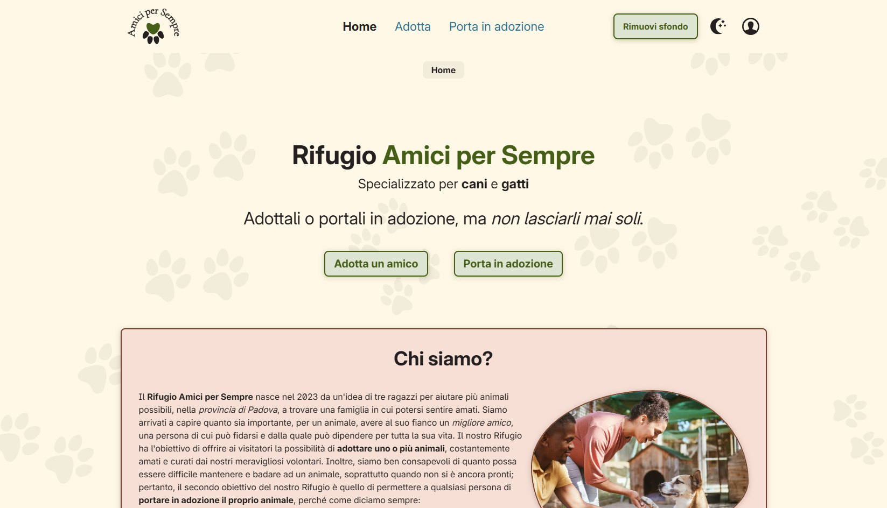
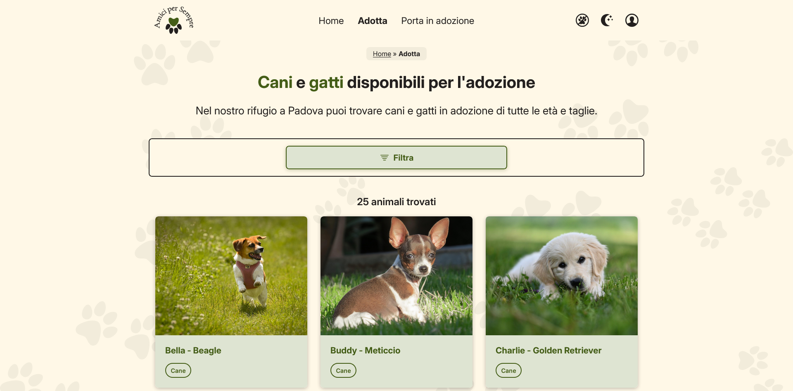
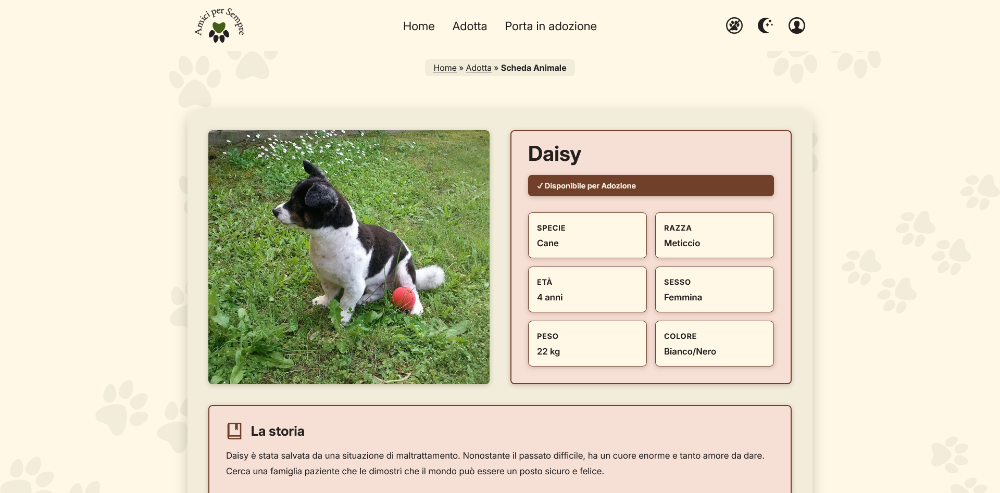
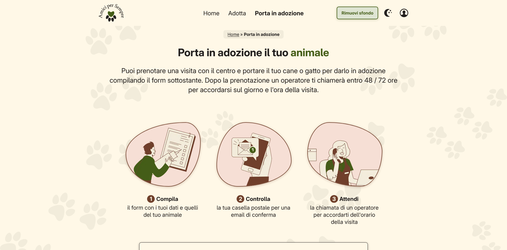
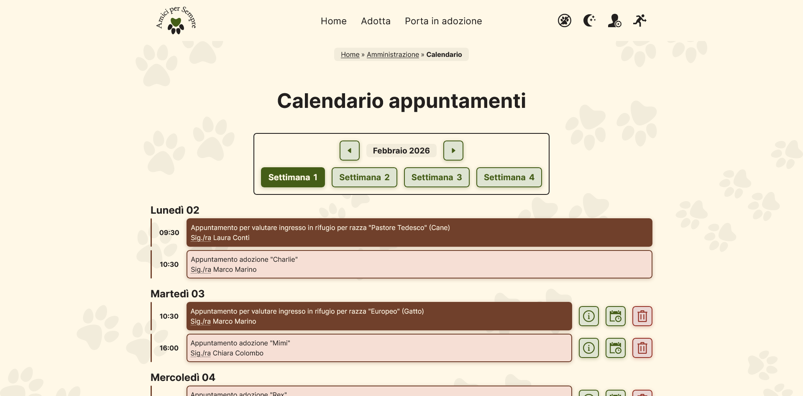
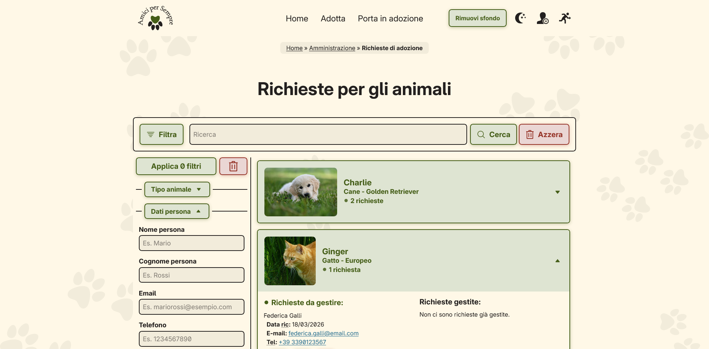
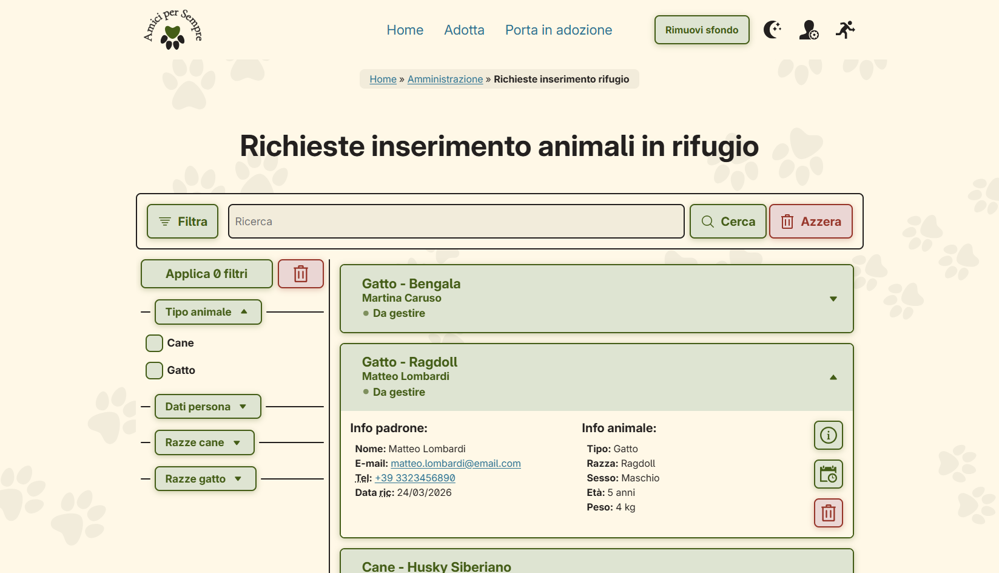

<p align="center">
  <picture>
    <source media="(prefers-color-scheme: dark)" srcset="/Resources/Vectors/Logo-Light.svg">
    
  </picture>
</p>
<p align="center">
   <em><strong>Thomas Morettin</strong></em> - <em><strong>Felician Mario Necsulescu</strong></em> - <em><strong>Niccolò Feltrin</strong></em>
</p>

#

Il seguente progetto è un lavoro realizzato in gruppo per il conseguimento del 75% della valutazione del corso di **Tecnologie Web [SCP4065581]** presso l'Università degli Studi di Padova (L.T. Informatica, A.A. 2025/26).

>La traccia accademica prevede la realizzazione di un sito web in **linguaggio HTML5**, con pagine che degradano in modo elegante e che si attengano alla sintassi XML.
>
>Il layout deve essere realizzato in **linguaggio CSS puro (CSS2/CSS3)**, completamente separato da contenuto e comportamento.
>
>Per l'esecuzione delle **operazioni CRUD** sui dati inseriti dall'utente deve essere usato il **linguaggio PHP**, con possibilità di memorizzazione all'interno di un database in **linguaggio MySQL**.
>
>Si richiede che il sito sia **accessibile** a tutte le categorie di utenti, anche tramite l'uso di tecnologie assistive per la navigazione.

## Contenuto del repository
Il lavoro è completo dei seguenti elementi:
* [**HTML**](HTML), [**CSS**](CSS), [**JavaScript**](JavaScript), [**PHP**](PHP) completo di tutti i file per lo sviluppo dei livelli contenuto, presentazione e comportamento del sito;
* [**relazione tecnica**](Relazioni/relazione.pdf) con gli approfondimenti sui contenuti del lavoro, le modalità di implementazione e la suddivisione dei compiti;
* [**relazione concorso**](Relazioni/relazione-concorso.pdf) con le verifiche necessarie all'accessibilità per la partecipazione al concorso [**Accattivante Accessibile 2026**](https://web.math.unipd.it/CAA/);
* [**database**](Databse) completo di struttura per la base di dati (normalizzata) e popolamento iniziale.

## Previews del progetto
<picture>
  <source media="(prefers-color-scheme: dark)" srcset="Previews/homepage-dark.png">
  
</picture>
<picture>
  <source media="(prefers-color-scheme: dark)" srcset="Previews/adotta-dark.png">
  
</picture>
<picture>
  <source media="(prefers-color-scheme: dark)" srcset="Previews/scheda-animale-dark.png">
  
</picture>
<picture>
  <source media="(prefers-color-scheme: dark)" srcset="Previews/porta-in-adozione-dark.png">
  
</picture>
<picture>
  <source media="(prefers-color-scheme: dark)" srcset="Previews/calendario-dark.png">
  
</picture>
<picture>
  <source media="(prefers-color-scheme: dark)" srcset="Previews/gestione-ticket-dark.png">
  
</picture>
<picture>
  <source media="(prefers-color-scheme: dark)" srcset="Previews/richieste-inserimento-dark.png">
  
</picture>

## Composer (PHPMailer & Emogrifier) - Linux
Librerie per il funzionamento della procedura di invio **mail automatica** all'invio del form da parte dell'utente (adotta/porta in adozione).
> [!NOTE]  
> **Il progetto funziona perfettamente anche senza l'installazione di queste librerie.**
1. Posizionarsi sulla cartella ```/PHP``` all'interno della ```root``` di progetto.
2. Digitare il seguente comando: ```curl -sS https://getcomposer.org/installer | php```.
3. Dopo l'installazione del file ```composer.phar``` digitare: ```php composer.phar install```

Alla comparsa della cartella ```/vendor``` l'installazione delle librerie è avvenuta con successo.
